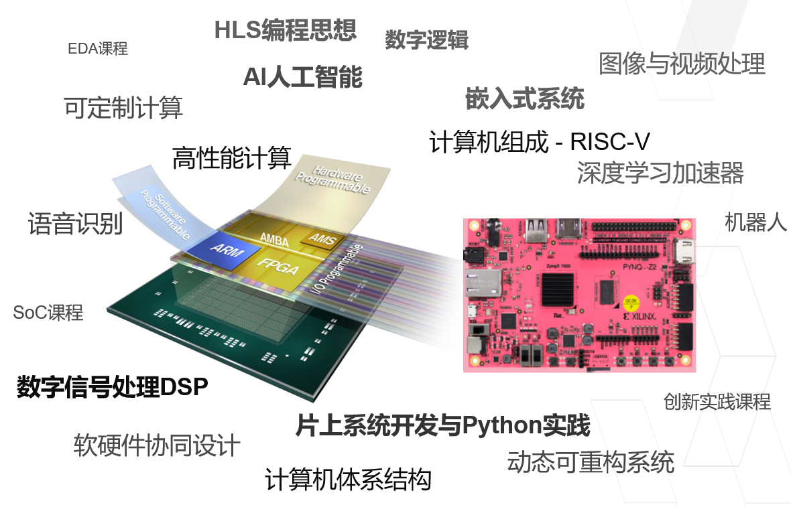
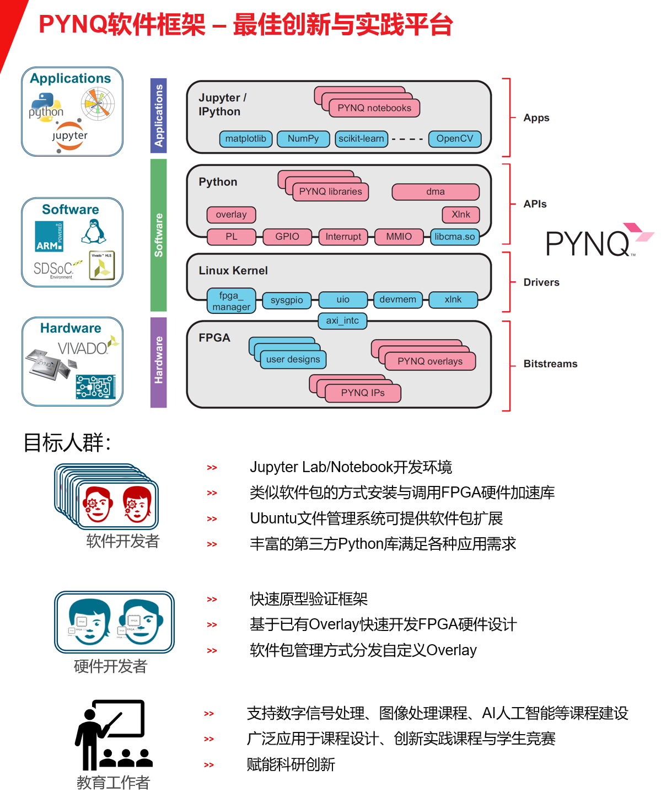

# 基于PYNQ框架的实验课程体系介绍

## PYNQ框架的实验课程体系
PYNQ框架支持电子信息类与计算机类专业的多门基础课与专业课，可作为从大一到大四的统一实验教学平台，真正意义上实现贯穿式统一教学。

本文主要对不同课程的已有PYNQ实验案例做一个归纳整理，如果您有课程建设或者相关培训需求，请关注**Xilinx技术社区**公众号获取最新技术资料与培训信息，或者通过邮箱咨询。xup_china@xilinx.com

## 什么是PYNQ？

PYNQ是Python On Zynq的缩写，它是一个开源软件框架，通过高层次的封装，PYNQ框架提供了完整的访问FPGA资源的Python library，让开发者通过Python API就可以轻松调用FPGA内的模块或算法。对于上层软件开发者，PYNQ框架可以让使用者采用类似安装软件包的方式安装PYNQ社区里包含FPGA硬件加速算法或IO扩展功能的已有Overlay到本地，然后像调用软件库一样去调用FPGA硬件模块，快速开发满足各种场景需求的应用程序，享受FPGA可并行计算、接口可方便扩展和可灵活配置带来的诸多好处；对于硬件开发工作者，PYNQ框架提供了通过Python对FPGA内算法或功能模块进行验证的快捷方式。同时，PYNQ框架预安装了丰富的Python库，由于采用了Ubuntu文件管理系统，具有极强的可扩展性，为应用开发提供了无限可能。
在PYNQ框架下，ARM A9 CPU上运行的软件包括但不限于：

- 载有Jupyter Notebooks设计环境的网络服务器
- IPython内核和程序包
- 嵌入式Linux
- Ubuntu文件管理系统
- FPGA的硬件库与Python API

请打开[PYNQ官方网站](www.pynq.io)获取PYNQ软件框架的详细介绍与PYNQ社区的已有Overlay汇总。同时也给大家准备了[PYNQ中文学习资料](https://pynqdocs.gitbook.io/pynq-tutorial/)。
